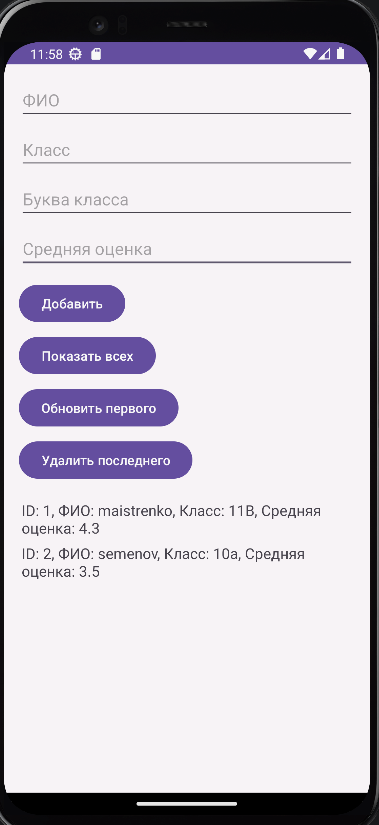

<div align="center">

# Отчет

</div>

<div align="center">

## Практическая работа №4

</div>

<div align="center">

## Работа с встроенной базой данных SQLite

</div>

**Выполнил:**
Майстренко Константин Александрович
**Группа:** инс-б-о-24-2

---

### Цель работы

Изучить основы работы с СУБД SQLite в Android-приложениях.
Научиться создавать базу данных, таблицы и выполнять основные операции CRUD (`Create`, `Read`, `Update`, `Delete`) с использованием класса `SQLiteOpenHelper`, а также отображать данные на экране.

### Ход работы

В ходе выполнения практической работы было создано Android-приложение для работы со встроенной базой данных SQLite.

Сначала был создан проект, после чего реализован класс `SQLHelper`, наследующийся от `SQLiteOpenHelper`. В этом классе были заданы основные параметры базы данных: имя базы, версия, имя таблицы и названия столбцов. Также был описан SQL-запрос для создания таблицы.

В методе `onCreate()` было реализовано создание таблицы при первом запуске приложения, а в методе `onUpgrade()` — удаление старой таблицы и её повторное создание при изменении версии базы данных.

После этого была создана модель данных, соответствующая структуре записи в таблице. Это позволило удобно представлять строки базы данных в виде Java-объектов.

Далее в классе `SQLHelper` были реализованы основные CRUD-операции:

* добавление новой записи в таблицу;
* получение списка всех записей;
* обновление существующей записи;
* удаление записи по идентификатору.

Затем была разработана главная активность приложения, в которой пользователь мог добавлять новые записи и выводить список сохранённых данных на экран. Для отображения использовался контейнер `LinearLayout`, в который динамически добавлялись элементы `TextView`.

В самостоятельной части было реализовано приложение по выбранному варианту с собственной структурой таблицы и полным набором операций для работы с данными: добавление, просмотр, изменение и удаление записей.

Ниже приведены скриншоты выполнения практической работы.

<div align="center">


*Рисунок 1. Реализация базовой работы с SQLite и вывод записей на экран*

</div>

<div align="center">


*Рисунок 2. Выполнение самостоятельного задания по выбранному варианту*

</div>

### Вывод

В результате выполнения практической работы были изучены основы работы со встроенной базой данных SQLite в Android.
Я научился создавать базу данных и таблицы, использовать класс `SQLiteOpenHelper`, выполнять основные операции CRUD и отображать данные в интерфейсе приложения.
Практическая работа помогла понять, как организуется локальное хранение данных в Android-приложениях и как управлять ими программно.

### Ответы на контрольные вопросы

1. **Какие типы данных поддерживает SQLite? Как в SQLite можно хранить логические значения и даты?**
   SQLite поддерживает типы `NULL`, `INTEGER`, `REAL`, `TEXT`, `BLOB` и `NUMERIC`.
   Логические значения обычно хранятся как `INTEGER`, где `1` — это `true`, а `0` — `false`.
   Даты можно хранить как текст в формате `YYYY-MM-DD`, как целое число `INTEGER` в виде Unix timestamp или как `REAL`.

2. **Для чего нужен класс SQLiteOpenHelper? Опишите назначение методов onCreate() и onUpgrade().**
   `SQLiteOpenHelper` нужен для удобного создания и обновления базы данных в Android.
   Метод `onCreate()` вызывается при первом создании базы данных и обычно содержит SQL-команды создания таблиц.
   Метод `onUpgrade()` вызывается при изменении версии базы данных и используется для обновления структуры таблиц.

3. **В чем разница между getWritableDatabase() и getReadableDatabase()? В каких ситуациях может возникнуть ошибка при вызове getWritableDatabase()?**
   `getWritableDatabase()` открывает базу данных для чтения и записи.
   `getReadableDatabase()` открывает базу только для чтения, если запись недоступна.
   Ошибка при вызове `getWritableDatabase()` может возникнуть, например, если на устройстве недостаточно памяти или файловая система недоступна для записи.

4. **Что такое Cursor? Как правильно перемещаться по его элементам и почему важно закрывать его после использования?**
   `Cursor` — это объект, который хранит результат SQL-запроса и позволяет последовательно читать строки таблицы.
   Обычно работа начинается с `moveToFirst()`, а затем используется `moveToNext()` для перехода по строкам.
   Закрывать `Cursor` важно, чтобы освобождать системные ресурсы и не допускать утечек памяти.

5. **Что такое ContentValues и для каких операций он применяется?**
   `ContentValues` — это контейнер вида «ключ-значение», где ключом является имя столбца, а значением — данные для записи.
   Он применяется при вставке (`insert`) и обновлении (`update`) записей в базе данных.

6. **В чем отличие методов query() и rawQuery()? Приведите пример использования rawQuery() с параметром-плейсхолдером (?).**
   `query()` — это более удобный и безопасный метод построения SQL-запросов без ручной сборки строки.
   `rawQuery()` позволяет написать SQL-запрос вручную.
   Пример:

   ```java
   Cursor cursor = db.rawQuery(
       "SELECT * FROM students WHERE age > ?",
       new String[]{"18"}
   );
   ```

7. **Как обработать ситуацию, когда таблица уже существует, но её структура была изменена (например, добавлено новое поле)?**
   В таком случае увеличивают версию базы данных и изменяют логику в `onUpgrade()`.
   Например, можно удалить старую таблицу и создать новую заново либо выполнить миграцию данных через SQL-команды `ALTER TABLE`, чтобы сохранить уже существующие записи.

### Список литературы

1. Phillips, B., Stewart, K., & Marsicano, K. *Android Programming: The Big Nerd Ranch Guide* (5th Edition). Big Nerd Ranch Guides, 2022.
2. Документация Android Developers. Материалы по хранению данных и работе с базами данных.
3. Гриффитс Д., Гриффитс Д. *Head First. Программирование для Android*. Питер, 2021.
4. Соколова В. В. *Разработка мобильных приложений на платформе Android*. М.: Юрайт, 2021.
5. Мэрфи М. *Основы Android программирования на Java*. СПб.: БХВ-Петербург, 2019.
